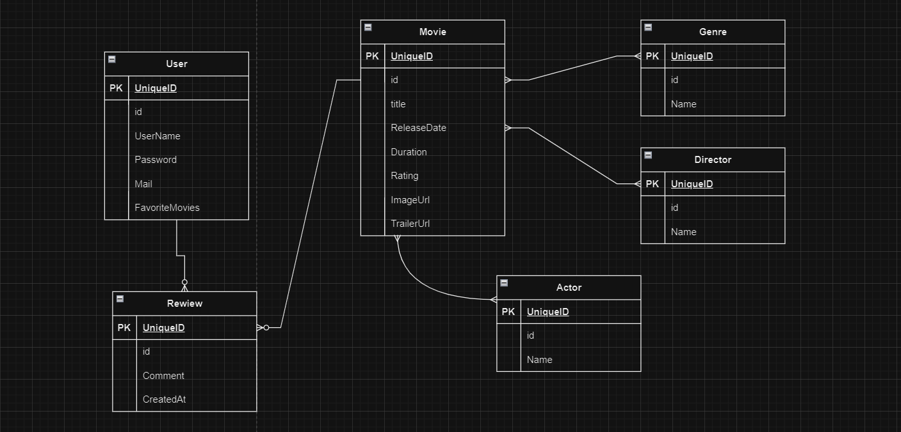

# 🎬 N-Tier Architecture Movie App

This project is a movie application developed using the principles of N-Tier Architecture.  
Users can browse movie listings, view details, add movies to their favorites, and write comments.
Admin users can add/edit/delete movies and categories, as well as moderate user comments.

## 🧱 Project Architecture



The application is structured into four main layers:

- **Entity Layer**: Contains data models and entity classes.
- **Data Access Layer (DAL)**: Handles data operations using Entity Framework.
- **Business Layer**: Contains business logic and service classes.
- **Presentation Layer (WebUI)**: Implements the user interface using ASP.NET MVC.

This layered architecture promotes modularity, separation of concerns, and maintainability.

## ⚙️ Technologies Used

- ASP.NET CORE MVC (.NET Framework)
- Entity Framework (Code First approach)
- PostgreSQL (LocalDB)
- HTML, CSS, JavaScript

## 👥 User Roles

1. **Regular User**:
   - Can browse movie listings
   - Can add comments
   - Can mark movies as favorites

2. **Admin User**:
   - Can add new movies and categories
   - Can update or delete existing movies and categories
   - Can delete user comments

## 🚀 Getting Started

1. Clone this repository:
   ```bash
   git clone https://github.com/Metehanglsr/N-Tier-Architecture-Movie-App.git

   Open the movieapp.webui.sln file with Visual Studio.

2. Restore the required NuGet packages.

3. Use Entity Framework Code First to create the database.

4. Run the application by pressing F5.

## 📁 Project Structure

```text
N-Tier-Architecture-Movie-App/
├── movieapp.entity/         # Data models
├── movieapp.data/           # Data access layer
├── movieapp.business/       # Business logic and services
├── movieapp.webui/          # Presentation layer (MVC UI)
└── movieapp.webui.sln       # Solution file
